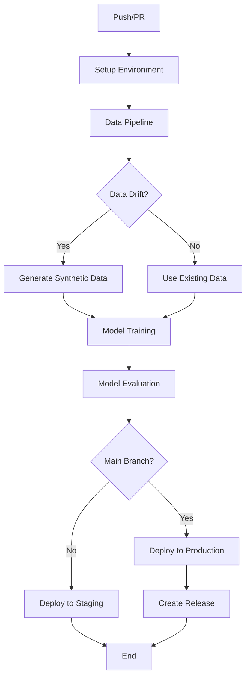

# MLOps Pipeline with DVC and MLflow

Panduan lengkap untuk menggunakan DVC API dan MLflow API dalam CI/CD pipeline dengan GitHub Actions.

## 🏗️ Arsitektur MLOps

```
┌─────────────────┐    ┌─────────────────┐    ┌─────────────────┐
│   Data Source   │    │   DVC Storage   │    │ MLflow Registry │
│                 │    │                 │    │                 │
│ • Original Data │────┤ • Data Versions │    │ • Model Store   │
│ • Synthetic     │    │ • Artifacts     │    │ • Experiments   │
│   Data          │    │                 │    │ • Metrics       │
└─────────────────┘    └─────────────────┘    └─────────────────┘
         │                       │                       │
         │                       │                       │
         └───────────────────────┼───────────────────────┘
                                 │
                    ┌─────────────────────────┐
                    │   GitHub Actions        │
                    │   CI/CD Pipeline        │
                    │                         │
                    │ • Data Drift Detection  │
                    │ • Model Training        │
                    │ • Model Evaluation      │
                    │ • Model Deployment      │
                    └─────────────────────────┘
```

## 🚀 Quick Start

### 1. Setup Environment

```bash
# Clone repository
git clone <your-repo>
cd Tugas-1-MLOps

# Run setup script
chmod +x setup_mlops.sh
./setup_mlops.sh
```

### 2. Start MLflow Server

```bash
# Linux/Mac
./start_mlflow.sh

# Windows
start_mlflow.bat
```

Akses MLflow UI di: http://localhost:5000

### 3. Configure GitHub Secrets

Tambahkan secrets berikut di GitHub repository settings:

```
# MLflow Configuration
MLFLOW_TRACKING_URI=https://your-mlflow-server.com
MLFLOW_TRACKING_USERNAME=your-username
MLFLOW_TRACKING_PASSWORD=your-password

# DVC Configuration (for S3)
AWS_ACCESS_KEY_ID=your-access-key
AWS_SECRET_ACCESS_KEY=your-secret-key
DVC_REMOTE_URL=s3://your-bucket/dvc-storage

# GitHub Token
GITHUB_TOKEN=your-github-token
```

## 📊 Pipeline Components

### 1. Data Pipeline (`data-pipeline` job)

- **Data Drift Detection**: Menggunakan statistical tests untuk mendeteksi perubahan data
- **Synthetic Data Generation**: Generate data sintetik jika drift terdeteksi
- **DVC Integration**: Version control untuk data dan artifacts

```python
# Example: Manual data drift check
python scripts/check_data_drift.py
```

### 2. Model Training (`model-training` job)

- **MLflow Experiment Tracking**: Track experiments, parameters, dan metrics
- **Hyperparameter Tuning**: Grid search untuk optimal parameters
- **Model Registry**: Register trained models dengan versioning

```python
# Example: Training with MLflow
python train_with_mlflow.py
```

### 3. Model Evaluation (`model-evaluation` job)

- **Performance Metrics**: Accuracy, Precision, Recall, F1-score, AUC
- **Visualization**: Confusion matrix, ROC curves, feature importance
- **Model Comparison**: Compare dengan previous models

```python
# Example: Model evaluation
python evaluate_model.py
```

### 4. Model Deployment (`deploy` job)

- **Stage Management**: Staging → Production deployment
- **Model Validation**: Pre-deployment validation checks
- **Rollback Support**: Rollback ke previous version jika needed

```python
# Example: Deploy to staging
python scripts/deploy_model.py --environment staging

# Example: Deploy to production
python scripts/deploy_model.py --environment production
```

## 🔄 CI/CD Workflow

### Trigger Conditions

1. **Push ke main/develop branch**: Full pipeline execution
2. **Pull Request**: Data validation dan model testing
3. **Manual Trigger**: Force retraining dengan custom parameters

### Pipeline Flow



## 📝 DVC API Usage

### Data Version Control

```bash
# Add data to DVC
dvc add Data/personality_datasert.csv
dvc add Data/synthetic_ctgan_data.csv

# Push to remote storage
dvc push

# Pull latest data
dvc pull

# Check data status
dvc status
```

### Pipeline Definition

```yaml
# dvc.yaml
stages:
  data_generation:
    cmd: python synthetic_generator.py
    deps:
    - Data/personality_datasert.csv
    - synthetic_generator.py
    outs:
    - Data/synthetic_ctgan_data.csv

  training:
    cmd: python train_with_mlflow.py
    deps:
    - Data/synthetic_ctgan_data.csv
    - train_with_mlflow.py
    outs:
    - Model/
```

## 🧪 MLflow API Usage

### Experiment Tracking

```python
import mlflow

# Start experiment
with mlflow.start_run():
    # Log parameters
    mlflow.log_param("n_estimators", 100)
    mlflow.log_param("max_depth", 10)
    
    # Log metrics
    mlflow.log_metric("accuracy", 0.95)
    mlflow.log_metric("f1_score", 0.93)
    
    # Log model
    mlflow.sklearn.log_model(model, "model")
    
    # Log artifacts
    mlflow.log_artifact("confusion_matrix.png")
```

### Model Registry

```python
# Register model
mlflow.register_model(
    model_uri="runs:/<run_id>/model",
    name="personality-classifier"
)

# Transition model stage
client = mlflow.tracking.MlflowClient()
client.transition_model_version_stage(
    name="personality-classifier",
    version=1,
    stage="Production"
)
```

### Model Loading

```python
# Load model from registry
model = mlflow.pyfunc.load_model(
    model_uri="models:/personality-classifier/Production"
)

# Make predictions
predictions = model.predict(data)
```

## 🔍 Monitoring & Alerting

### Data Drift Detection

Script `scripts/check_data_drift.py` menggunakan:

- **Kolmogorov-Smirnov test** untuk numerical features
- **Chi-square test** untuk categorical features
- **Statistical significance threshold**: p < 0.05

### Model Performance Monitoring

- Track model accuracy over time
- Alert jika performance degradation
- Automatic retraining triggers

## 🐳 Docker Integration

```dockerfile
# Dockerfile for model serving
FROM python:3.9-slim

WORKDIR /app
COPY requirements.txt .
RUN pip install -r requirements.txt

COPY . .
EXPOSE 8000

CMD ["python", "App/app.py"]
```

## 📊 Environment Configuration

### Development

```bash
# .env.development
MLFLOW_TRACKING_URI=http://localhost:5000
DVC_REMOTE_URL=./dvc-storage
ENVIRONMENT=development
```

### Production

```bash
# .env.production
MLFLOW_TRACKING_URI=https://your-mlflow-server.com
DVC_REMOTE_URL=s3://your-bucket/dvc-storage
ENVIRONMENT=production
```

## 🛠️ Troubleshooting

### Common Issues

1. **MLflow Connection Error**
   ```bash
   # Check MLflow server status
   curl http://localhost:5000/health
   
   # Restart MLflow server
   ./start_mlflow.sh
   ```

2. **DVC Remote Access**
   ```bash
   # Check DVC remote configuration
   dvc remote list
   
   # Test remote access
   dvc remote modify storage --test
   ```

3. **GitHub Actions Secrets**
   - Pastikan semua required secrets sudah di-set
   - Check logs untuk authentication errors

### Debugging

```bash
# Enable debug logging
export MLFLOW_LOGGING_LEVEL=DEBUG
export DVC_LOGGING_LEVEL=DEBUG

# Run with verbose output
python train_with_mlflow.py --verbose
```

## 📚 Additional Resources

- [MLflow Documentation](https://mlflow.org/docs/latest/)
- [DVC Documentation](https://dvc.org/doc)
- [GitHub Actions MLOps Examples](https://github.com/actions/ml-examples)

## 🤝 Contributing

1. Fork repository
2. Create feature branch
3. Make changes dan test locally
4. Submit pull request
5. CI/CD pipeline akan run automatically

## 📄 License

MIT License - lihat file LICENSE untuk details.
